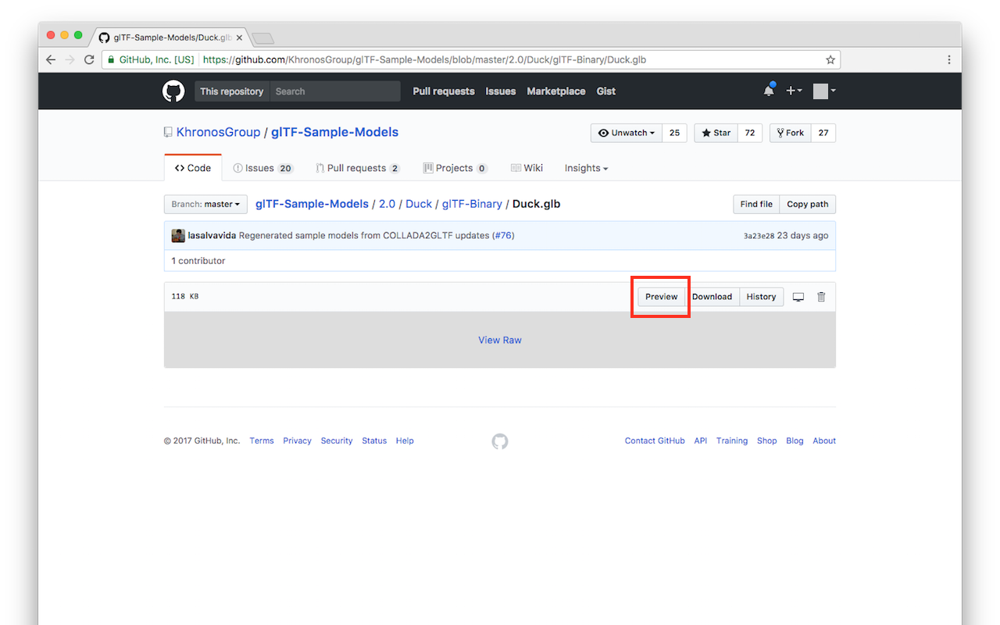

# glTF Preview for GitHub

Adds a preview button for glTF 2.0 models on GitHub.

## Installation

Available for [Chrome](https://chrome.google.com/webstore/detail/gltf-preview-for-github/cokmplcldeedmnkojcinmmpjkpnalbci) and [Firefox](https://addons.mozilla.org/en-US/firefox/addon/gltf-github-preview/).

## Permissions

> *Read and change your data on github.com.*

Required to access glTF content on the page you're viewing.

> *Read your browsing history.*

GitHub uses the History API when changing pages, and this extension can't tell when you open a new page on the GitHub website without access to browsing history.

